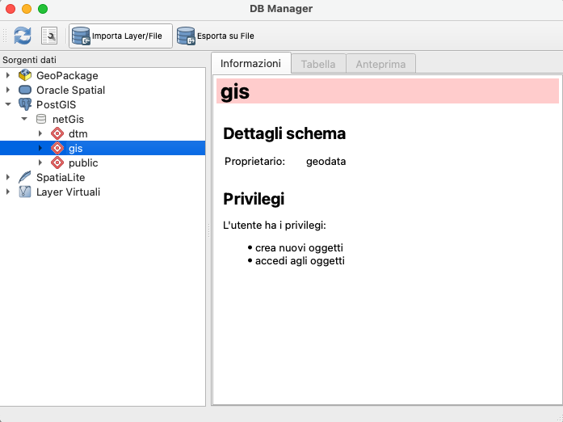
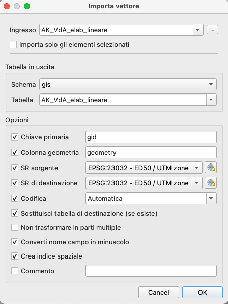

# Import Shape File to PostGis

## Docker

To build a Docker image from a Dockerfile, you can use the docker build command. The basic syntax is as follows:

```bash
docker build -t <image_name> .
```

For example, if you have a Dockerfile in the current directory and you want to name the image *myimage*, you would run the following command:

```bash
docker build -t myimage .
```
The -t flag is used to specify the name and optionally a tag to the name of the image in the name:tag format.
Copy all shape file to directory **data** and run this command for example:

```bash
docker run --network gis --env-file ../.env -e PGHOST=pgsql --cpus=".75" --memory=4g gzileni/geodata-import python3 shape.py --file oldtown --schema gis
```

where `--network gis` are network name in the docker-compose file, `PGHOST=pgslq` are the service's name postgres container, and finally `--file oldtown` are file's name copied in folder *data*. 

#### Disclaimers
It's important setup *.env file* to read environment variable with options `--env-file ../.env`. 
For very large shape files it is advisable to add the options `--cpus=".75" --memory=4g`.

### QGIS
To import with QGIS, after added shape file to QGIS Project and *created database connection to postgis container*, you can choise menu item **Database -> DBManager**



and set all options:




